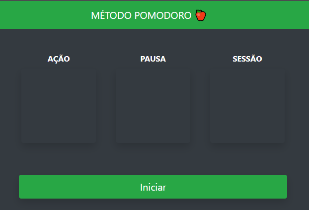
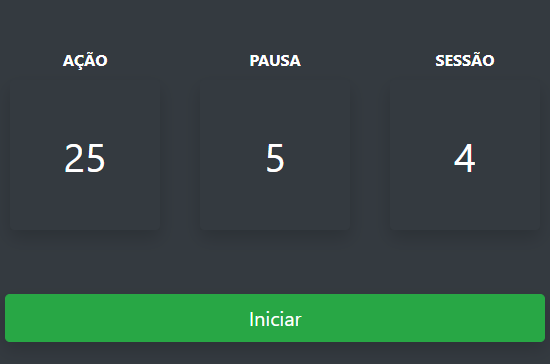

<h1 align="center">Desafio Jera - Pomodoro 🍎</h1>

Desafio proposto pela Jera Academy. Criar uma ferramenta para auxiliar quem trabalha com o método pomodoro.

<a href="https://www.wikiwand.com/pt/Técnica_pomodoro">Saiba mais sobre o Pomodoro</a>  

 
 <h2>🕹️ Tecnologias Utilizadas</h2>
    <ul align="center">
        
        
        
        
    </ul>

 

<h2 align="center">🤔 Como utilizar?</h2>

A técnica Pomodoro é um método de gestão de tempo que pode ser aplicado para diversas tarefas. Podemos dividir a aplicação por minutos de Ação, Pausa e quantas Sessões:
 

 

<h2 align="center">🔗 Link da página</h2>

Logo abaixo temos o link da página para visualização e testes:

👉 <a href="https://oseiasweb.github.io/jera-pomodoro/">Desafio Jera - Pomodoro</a>  

<h2 align="center">🏆 Status Projeto</h2>

 

